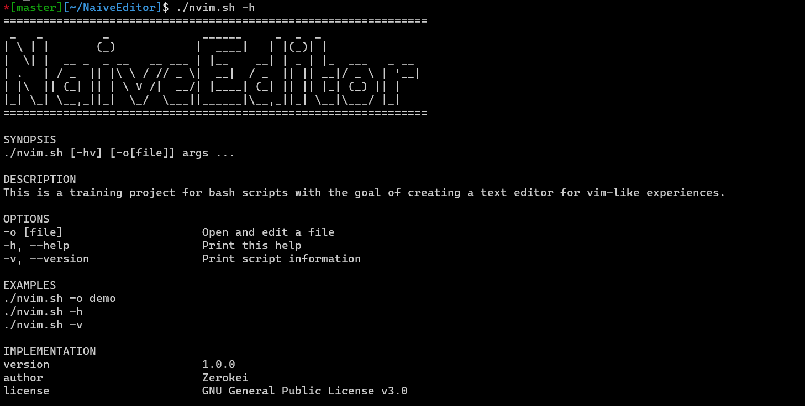

# Naive Editor :ram:
Naive Editor is a simple editor designed with bash language.

## About
This is a training project for bash scripts with the goal of creating a text editor for vim-like experiences.

## Features
- Normal Mode
	- View the text
	- Move the cursor by 'hjkl'
- Editor Mode (enter->press 'i' & exit->press 'Esc')
	- Insert text
	- Delete text
- Save and quit
	- Save :w
	- Quit :q
## Usage

```bash
# get help
$ ./nvim -h
# get version
$ ./nvim -v
# edit file
$ ./nvim -o demo
```

### Available opertions in nvim
- View Mode(default)
	- 'l' move cursor to the right
	- 'h' move cursor to the left
	- 'j' move cursor to the next line
	- 'k' move cursor to the previous line
	- 'i' enter the edit mode
	- ':'
		- ':w' save the file
		- ':q' quit the file
- Edit Mode
	- 'esc': quit thet Edit Mode and enter the view mode
	- other input: input befor the position of the cursor
## Demos



## References
[[E]ditor [I]n [S]hell - by Geronymos](https://github.com/Geronymos/EIS)  
[XED](https://github.com/zcjrony/xed)
